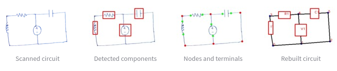
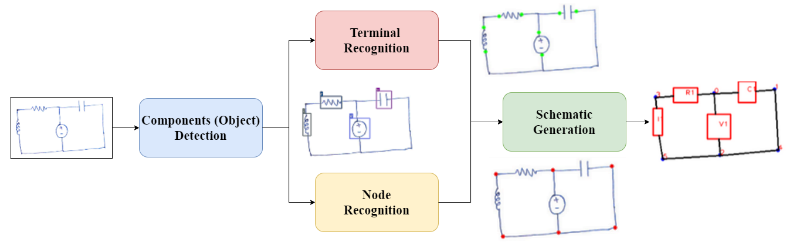
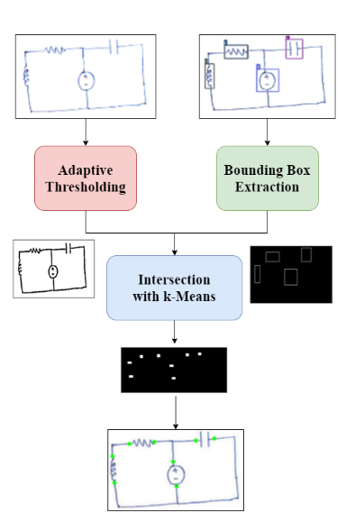

# Hand-Drawn Electrical Circuit Recognition using Object Detection and Node Recognition
This project proposes a real-time algorithm for the automatic recognition of hand-drawn electrical circuits based on object
detection and circuit node recognition. The proposed approach employs You Only Look Once version 5 (YOLOv5) for
detection of circuit components and a novel Hough transform based approach for node recognition. Using YOLOv5 object
detection algorithm, a mean average precision (mAP0.5) of 98.2% is achieved in detecting the components. The proposed
method is also able to rebuild the circuit schematic with 80% accuracy with a near-real time performance of 0.33s per
schematic generation

Journal Publication : [Springer Link](https://link.springer.com/article/10.1007/s42979-022-01159-0)

Implementation : [Website Link](https://rohithreddy0087-hand-drawn-electrical-circuit-rec-webapp-hnh3kr.streamlitapp.com/)

## Proposed method

The proposed approach consists of circuit component detection, node and terminal recognition and schematic generation. In the
proposed approach, a lightweight neural network (NN) is employed to detect the components in the circuit. The NN models can be
trained to be robust to any changes in the input images, hence the scanned circuit image can be given directly to the model 
without applying any morphological operation. The object detection model outputs the bounding boxes and the
classes of the components. Using these bounding boxes, the terminals and the nodes of the components can be
traced. Using the detected classes, bounding boxes, terminals and nodes, the entire circuit schematic can be
generated which can later be mapped to a suitable netlist.

### Detection of Circuit Components
Proposed approach uses YOLOv5 to detect components.
Reference: [YOLOv5](https://github.com/ultralytics/yolov5)
### Terminal Recognition
To extract these terminals, two binary images are generated 1) from the output of the bounding boxes generated by objection
detection and 2) adaptive thresholding of the scanned image. Based on the intersection of the adaptive
thresholded binarized circuit and the thresholded and binarized bounding boxes, the terminals can be identified.
However, to improve the results, the centre of the intersections can be estimated using k-means clustering
which results in a robust estimate of the terminal points.

### Node Recognition
Nodes can be considered as the intersection points of horizontal and vertical
lines. Hough Transform is employed to detect the lines. Then these lines are
segmented based on the orientation of the line as mostly horizontal and vertical lines will be of interest to us.

### Circuit Schematic Generation
In most of the electrical circuits, the terminals of a
component are connected to the nearest node, but this
might not be true in all cases, taking account of the majority
cases, a distance-based algorithm is proposed. After
obtaining all the terminals, nodes, and components in the
circuit, connections can be traced by mapping them to each
other. 

## Dataset and Training
There is no publicly available dataset, a custom dataset is generated by collecting hand-drawn circuits
drawn by five different people. This paper focuses only on certain electrical components such as voltage source,
resistor, capacitor, inductor, and diode, however the algorithm could be extended to any component with
necessary retraining. A total of 154 circuit images are collected and manually labelled and out of these 154 images, 103 images
are used for training the NN model and 51 images are used for validating and testing the model. To keep the categories
balanced, almost all classes are equally represented. To increase the data for training, data augmentation like
rotating and flipping the image are used to create a dataset with 388 images for training.

Using PyTorch framework and the YOLOv5 network, component detection is trained. The images are resized as 416x416 for YOLO.
The other parameters for training the YOLO models are as follows: learning rate was 0.001, momentum was 0.937, the batch 
size was set to 16 and the number of epochs for which the model was trained is 500.